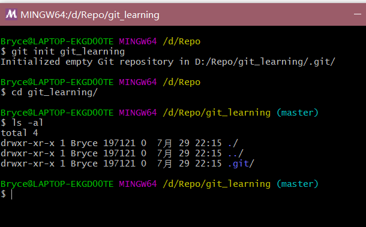

### [Git-learning : 04] 创建并配置第一个仓库

#### 一、建Git仓库

**两种场景：**

##### 1.把已有的项目代码纳入Git管理

```shell
$ cd 项目代码所在的文件夹
$ git init
```

##### 2.项目直接用Git创建并管理
```shell
$ cd 某个文件夹
$ git init your_project
$ cd your_project
```


#### 二、配置仓库的local config

```shell
$ git config --local user.name your_name
$ git config --local user.email your_email
```

*local config 的优先级 > global config 的优先级*


