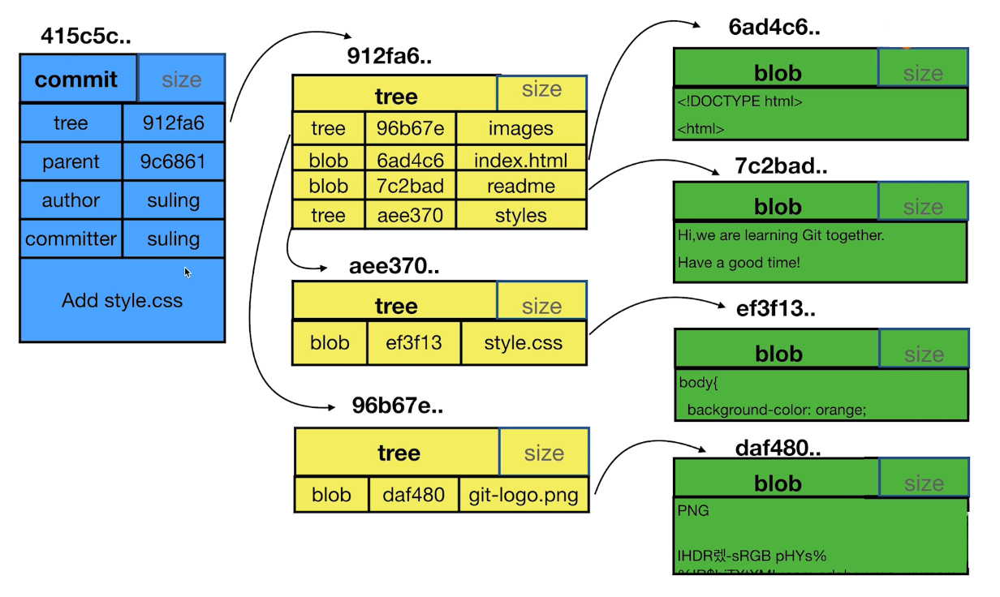

#### [Git-Learning : 11] commit、tree、blob 的关系

- 一个commit对应一个tree，这个tree表示commit时的文件快照
- tree类似文件夹，blob类似文件
- 一个 tree 中保存若干个 tree 和 blob
- 相同的文件内容只对应一个blob
- git log 展示的信息就是 commit 保存的
- git add 会产生对应的blod
- git commit 会产生对应的commit 和 tree