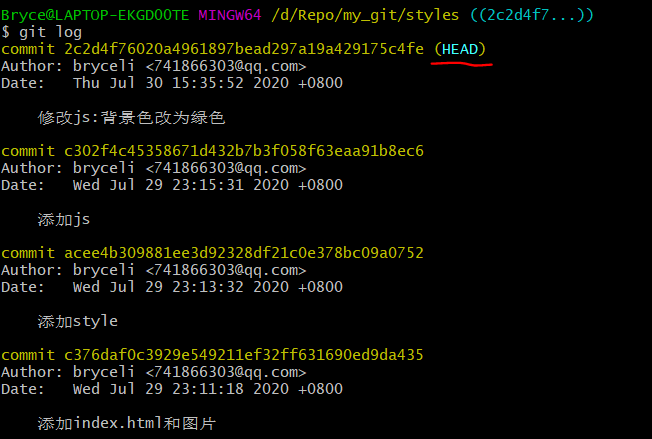
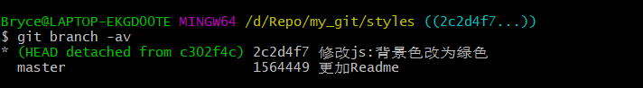
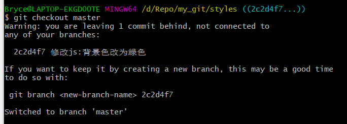
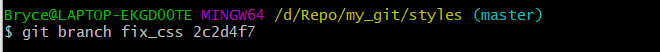
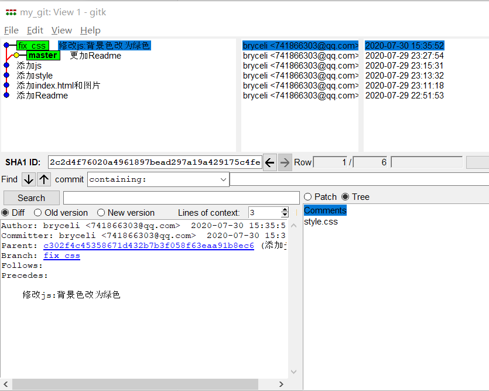

#### [Git-Learning : 13] 分离头指针状态下的注意事项

当我们从一个branch上checkout到一个commit时，我们的git就会处于分离头指针状态，如图：



------

而当我们处于分离头指针状态下，又提交了新的commit，git会产生一个独立的branch，如下图



------

如果此时再次进行checkout，则当前的branch会处于丢弃状态，git 会发出警告信息，如下图



------

处于丢弃状态得branch如果不及时的将它真正的创建，则会被git自动清理掉。所以如果原来的branch需要保留，我们要对它进行创建。

```shell
$ git branch fix_css throw_branch
```



------

最终的log如下所示：

