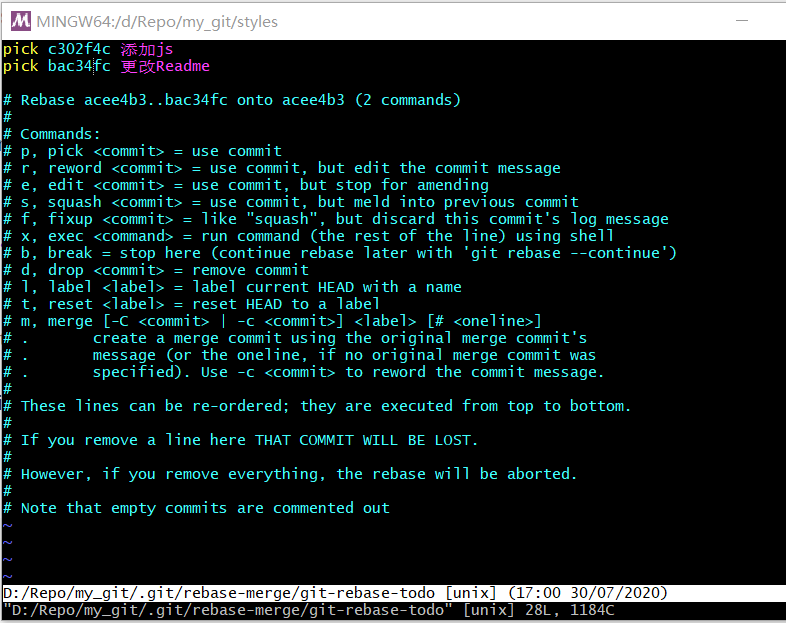
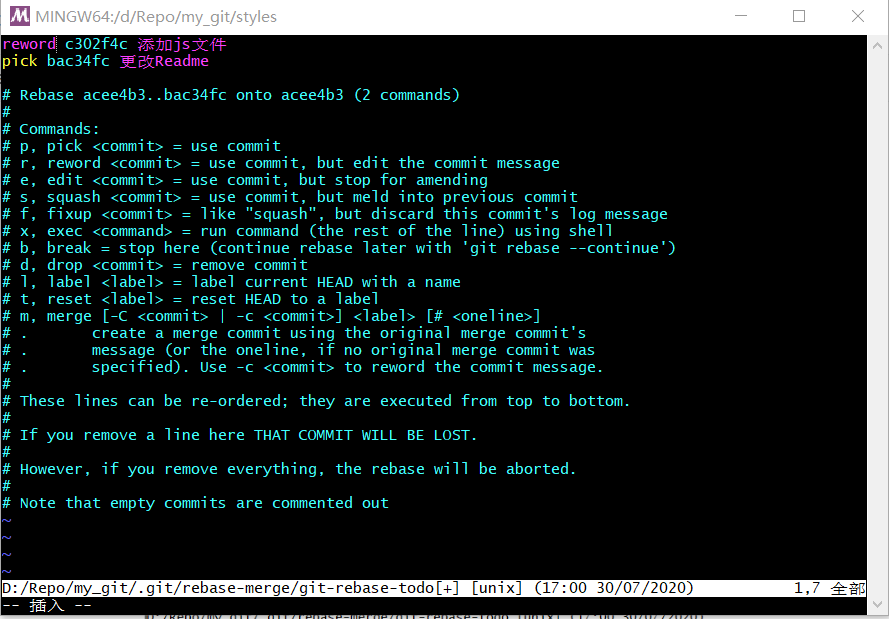
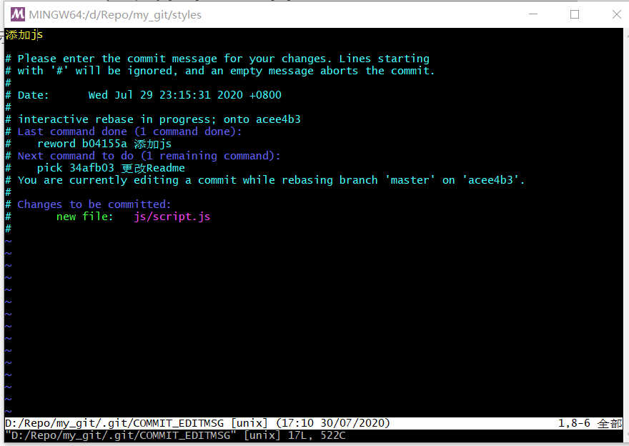
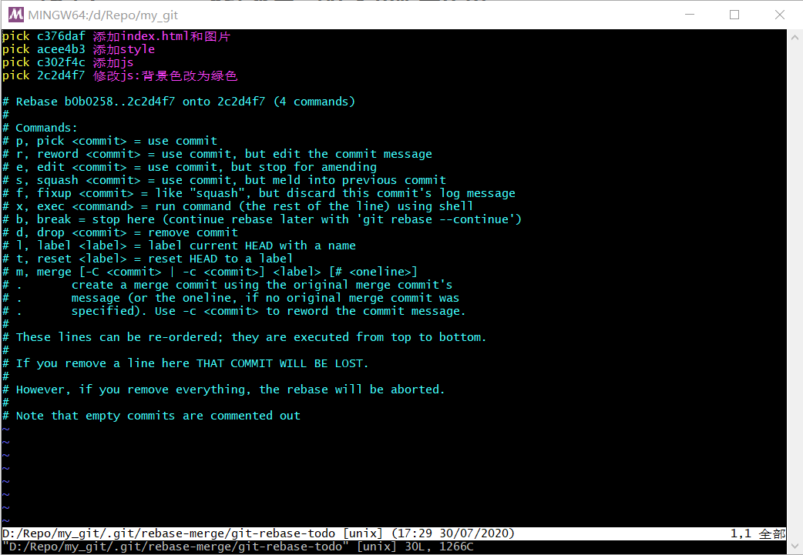
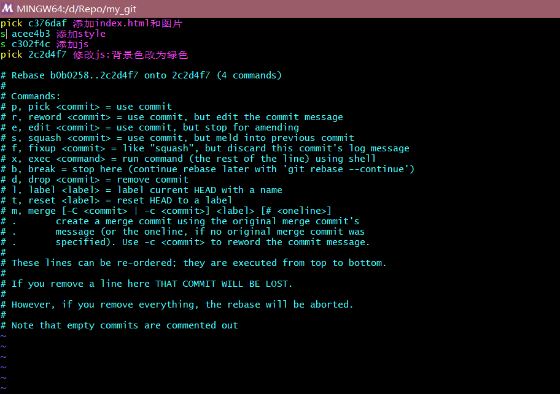
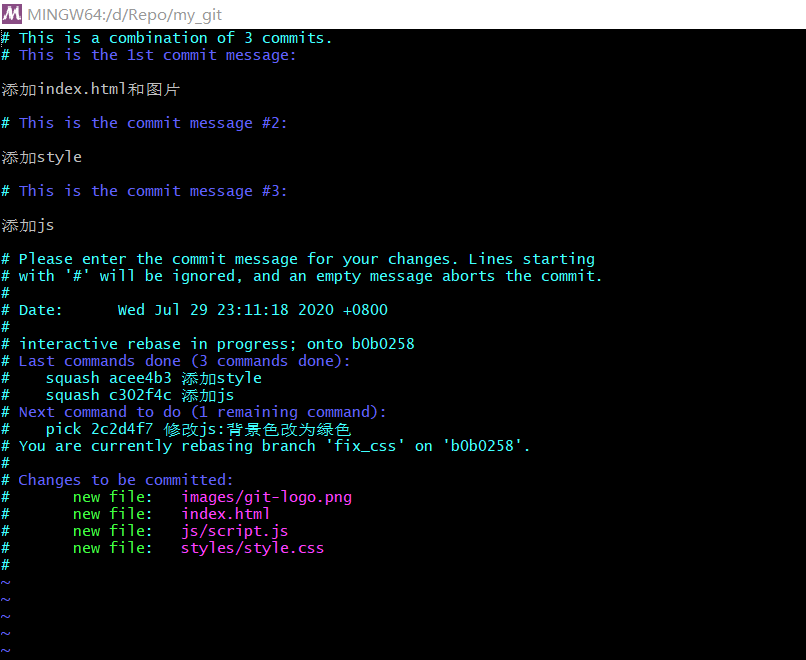
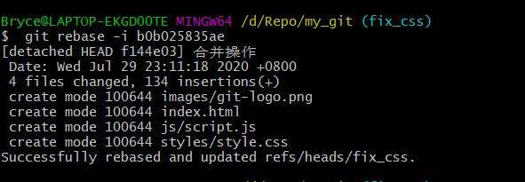

#### [Git-Learning : 14] git commit 管理

##### 一、消除 commit

三个场景：

1、丢弃当前的暂存区和工作区内容，将HEAD恢复到某一个 commit，同时消除该commit的所有子commit。

```shell
$ git reset --hard commit_id 
```


##### 二、修改message信息

两种场景：

1、修改最新一次 commit 的 message

```shell
$ git commit --amend     (打开最近一次的commit信息进行修改)
```

2、修改老旧 commit 的 message

选择需要修改commit的父commit进行变基
```shell
$ git rebase -i (交互式) parent_commit
```



根据下面的提示信息，将pick改为reword，再进行保存并退出



继续将message修改，进行保存后退出，完成修改message操作



##### 二、合并多个commit
两个场景：

###### 1、合并连续几个commit

还是使用变基操作,对其中最早的commit的父commit做变基

```shell
$ git rebase -i (交互式) parent_commit
```



根据下面的提示信息，对于需要合并的commit，将他们的pick改为squash，注意，这里显示的顺利从上到下是越来越新的commit，所以我们不能将最老的commit也改为squash，要保留为pick，接着将下面要合并的commit，将他们的pick改为squash，这样就会合并到最上面的commit上，最后保存并退出



紧接着设置合并后的commit的message





###### 2、合并间隔的几个commit

与合并连续的commit类似，但是要先调整顺序，如果要合并到最老的commit则需要在最上方补充pick信息

