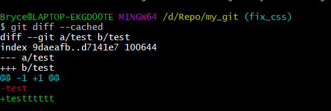
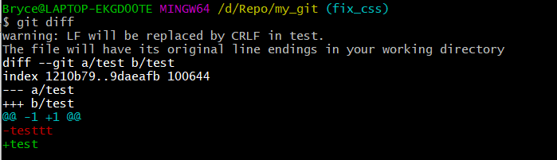

#### [Git-Learning : 15] git diff 比较差异

##### 一、比较暂存区和HEAD

```shell
$ git diff --cached
```



##### 二、比较工作区和暂存区

```shell
$ git diff 
```



##### 三、比较两个commit或branch

```shell
$ git diff commit01_id commit02_id -- <files>
$ git diff branch01_id branch02_id -- <files>
```

